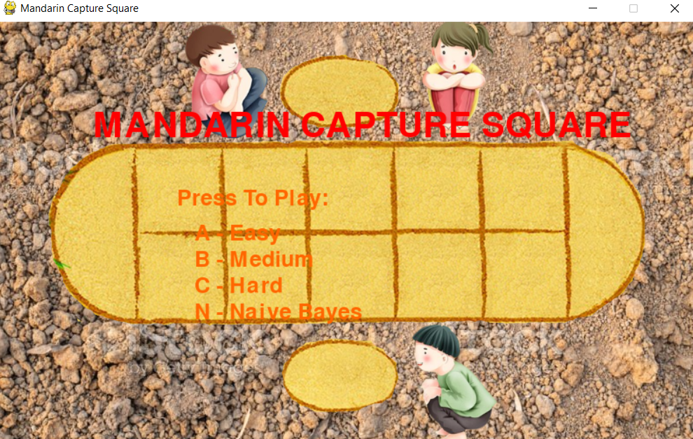
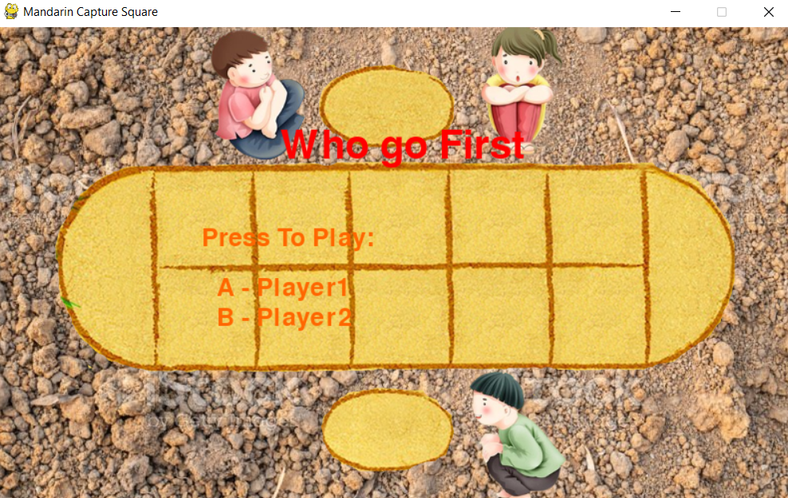
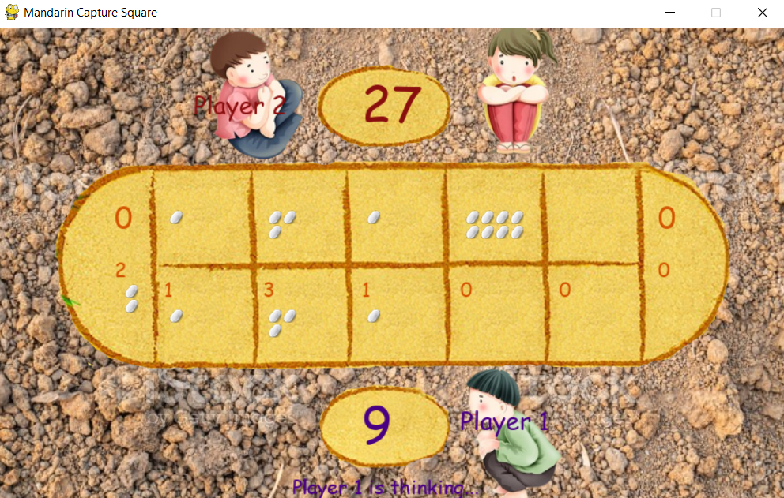
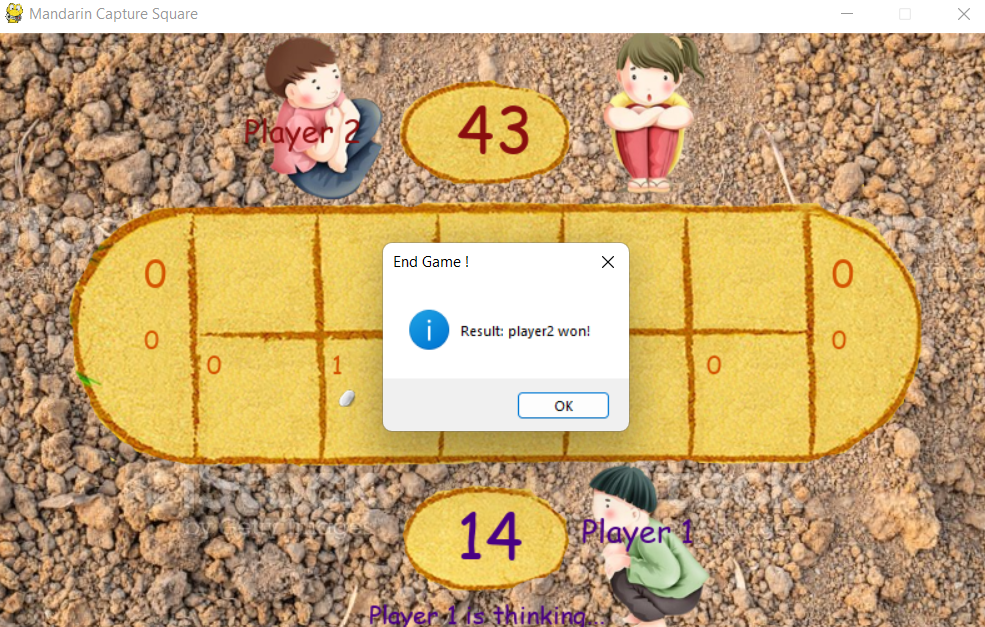

# AI_MandarinCaptureSquare
My Group Assignment for Introduction to Artificial Intelligence course (CO3061). This source code contains all the implementations and amenities needed for my Mandarin Capture Square game (we call it "Ô ăn quan" , one of the traditional games for Vietnamese), both Assignment 2 and Assignment 3.

Type `python main.py` to run the game :))

## Assignment 2: Minimax Algorithm 

Details for the algorithm: [Minimax](https://en.wikipedia.org/wiki/Minimax). Besides, we improved the algorithm with [Alpha-Beta Pruning strategy](https://en.wikipedia.org/wiki/Alpha%E2%80%93beta_pruning).

The agents is divided into 4 categories: Random Agent, Easy, Medium and Hard. Apart from the randomized agent, the division of level is basically depended on the depth of Game Tree (in this case, we set 3, 4 and 5 respectively).

This Algorithm produced significant good results, with the victory rate of almost 100% when playing with randomized agent.

## Assignment 3: Naive Bayes Network

[NB Network](https://en.wikipedia.org/wiki/Naive_Bayes_classifier) is one of the oldest ML Alg ever used in game solver. Initially, we didn't have high expectations for this technique as it was purposely wrong (as you may know, NB is prevalent for Classification problems :v). However, the results came out as not bad as we expected (70% winning matches). 

For ML Algs, the difficulty of Agent is definitely based on the quantity and quality of the dataset records. In this Assignment, we had collected datasets of 1000 and 5000 matches, which were played by 2 Random agents and 2 NB agents.

# Requirements:

* pygame
* numpy
* tkinter
* pandas

# Tech Stack:

* Game Development Language: Python
* Framework: pygame, tkinter
* Statistics Libraries: numpy. pandas

# For more information, you can visit our Youtube videos (Vietnamese):
* Assignment 2: https://www.youtube.com/watch?v=LWh8Iz22d04 
* Assignment 3: https://www.youtube.com/watch?v=s2-FocOIfOM

# Images

## Mandarin

## Choose Player

## Main Game

## End Game

# Reference

Many thanks for [Christopher's](https://github.com/christopherohit/Mandarin_Square_Capturing) repository. We utilized his UI display code for easy interaction.

